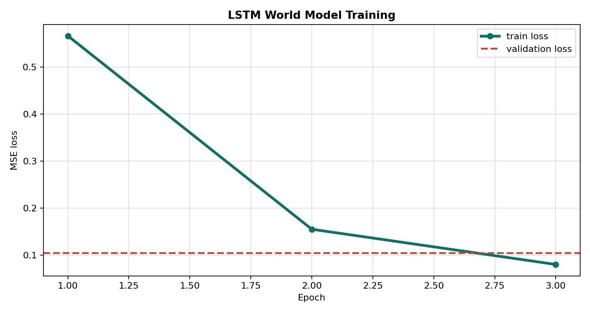
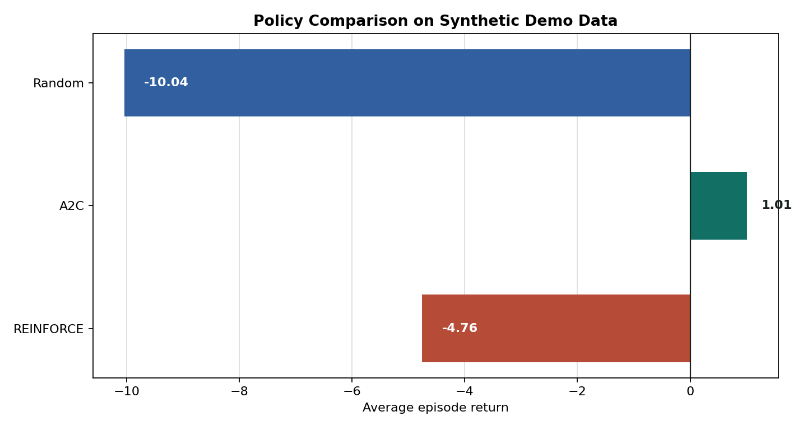
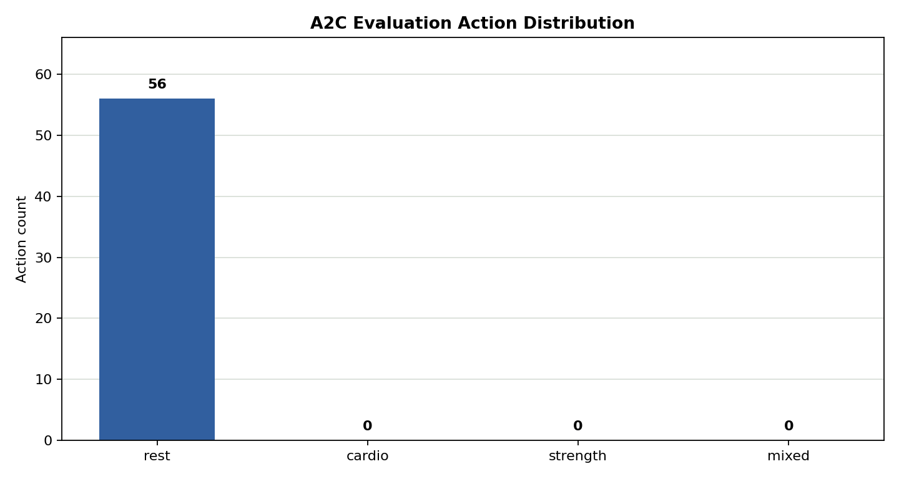

# RLGymTraining - Exercise 3

Educational project for personalized workout recommendation with an LSTM world model, REINFORCE, and Advantage Actor-Critic. This is not medical advice and not a production recommendation system.

## Why This Is RL
Prediction answers: "what happens next?" A policy answers: "what should the agent do next?" This project uses prediction only as a world model: an LSTM learns trainee dynamics so RL agents can practice sequential decisions. The objective is cumulative return over a full training episode, not local next-state accuracy alone.

RL mapping:

| Term | Implementation |
|---|---|
| Agent | REINFORCE or A2C trainer choosing workout actions |
| Environment / World Model | LSTM dynamics model plus reward and safety mask |
| State | Numeric trainee vector: readiness, fatigue, strength, endurance, soreness |
| Action | `rest`, `cardio`, `strength`, or `mixed` |
| Reward | Progress and readiness reward minus fatigue, soreness, overload, invalid-action penalties |
| Episode | Configurable sequence of training days, default 28 |
| Policy | Stochastic policy `pi_theta(a|s)` over discrete workout actions |
| Return | Discounted cumulative reward |
| Critic | A2C value estimator `V(s)` |

## Installation

```powershell
uv sync --extra dev
```

## Commands

```powershell
uv run rl-gym-training prepare
uv run rl-gym-training train-lstm
uv run rl-gym-training train-reinforce
uv run rl-gym-training train-a2c
uv run rl-gym-training evaluate-random
uv run rl-gym-training dashboard
```

The dashboard opens at `http://127.0.0.1:8765` by default and provides browser buttons for data preparation, LSTM training, REINFORCE, A2C, and random-policy evaluation. It is intentionally implemented as a lightweight web UI rather than Tkinter.

Quality checks:

```powershell
uv run pytest
uv run ruff check .
uv run ruff format --check .
```

Current local validation:

- `uv sync --extra dev --system-certs`: passed
- `uv run pytest`: 14 passed
- `uv run ruff check .`: passed
- `uv run ruff format --check .`: passed

## Data

The preferred workflow is to place a real chronological workout dataset at `data/raw/workout_sequences.csv`. Required columns are documented in [docs/PRD_data_pipeline.md](docs/PRD_data_pipeline.md). If that file is missing, the code creates a small synthetic fallback dataset for demos and tests only. It is clearly marked as synthetic and should not be presented as Kaggle results.

Processed chronological splits are saved under `data/processed/`. Scaling is fitted only on training rows and then applied to validation/test rows.

## Algorithms

REINFORCE optimizes `J(theta) = E[R(tau)]`. It samples actions from `pi_theta(a|s)`, stores log probabilities and rewards, computes discounted returns, and increases the probability of actions that appeared in high-return trajectories. It is on-policy: no replay buffer and no Q-table are used.

Basic REINFORCE has high variance because one sampled trajectory can be noisy. Reward-to-go and return normalization improve credit assignment by making each action depend more on future rewards after that action.

A2C separates Actor and Critic. The Actor outputs `pi_theta(a|s)`. The Critic estimates `V(s)` and acts as a learned baseline. Training uses:

```text
target = r + gamma * V(s_next) * (1 - done)
advantage = target - V(s)
actor_loss = -log_prob(action) * detached_advantage
critic_loss = MSE(V(s), target)
```

A2C is often more stable and sample-efficient than vanilla REINFORCE because the Critic supplies lower-variance feedback at each step.

## LSTM World Model

The LSTM predicts the next trainee state from a sequence of past states and actions. It is useful because fatigue, soreness, and progress are partially observable: one daily snapshot may not capture trend, recovery, or hidden load. The hidden state summarizes recent history, which connects the design to POMDP and learned-world-model ideas.

## Configuration And Security

All important hyperparameters live in `config/setup.yaml`: data path, split ratios, sequence length, seed, gamma, episode length, learning rates, entropy coefficient, and reward weights. No personal absolute paths or secrets are required. `.env-example` documents that no API key is needed for the demo/test path.

## Outputs

- `data/processed/train.csv`, `validation.csv`, `test.csv`
- `results/lstm_world_model.pt`
- `results/reinforce_metrics.json`
- `results/a2c_metrics.json`
- `results/random_policy_metrics.json`

## Browser Dashboard

The dashboard is the recommended visual demo path for the course submission:

```powershell
uv run rl-gym-training dashboard
```

It shows artifact status, average return comparison, loss curves, command output, and the synthetic-data caveat on the first screen. It calls the same SDK as the tests and CLI, so it does not duplicate training logic.

Large generated artifacts are ignored by git.

## Visual Demonstration

Dashboard preview:


Demo LSTM world-model training curve:



Synthetic fallback policy comparison:



A2C evaluation action distribution:



These images are generated from the current demo metrics and dashboard layout. To regenerate them after a new run:

```powershell
uv run python scripts/generate_readme_assets.py
```

## Documentation

- [docs/PRD.md](docs/PRD.md)
- [docs/PLAN.md](docs/PLAN.md)
- [docs/TODO.md](docs/TODO.md)
- [docs/PRD_problem_formulation.md](docs/PRD_problem_formulation.md)
- [docs/PRD_data_pipeline.md](docs/PRD_data_pipeline.md)
- [docs/PRD_lstm_world_model.md](docs/PRD_lstm_world_model.md)
- [docs/PRD_reward_function.md](docs/PRD_reward_function.md)
- [docs/PRD_reinforce.md](docs/PRD_reinforce.md)
- [docs/PRD_a2c.md](docs/PRD_a2c.md)
- [docs/EXPERIMENTS.md](docs/EXPERIMENTS.md)
- [docs/AI_WORKFLOW.md](docs/AI_WORKFLOW.md)
- [docs/COST_ANALYSIS.md](docs/COST_ANALYSIS.md)
- [docs/VERSION_HISTORY.md](docs/VERSION_HISTORY.md)

## Extension Points

Add a new dataset by changing `data.raw_path` and column names in config. Add a new action by updating `ACTION_NAMES`, the one-hot encoding, reward rules, and action mask. Replace the LSTM with a Transformer/RNN behind the same world-model interface. Add PPO later by creating a new `rl/ppo.py` and service wrapper. Safety constraints can be changed in `rl/action_masking.py`. A future dashboard can call the SDK without changing algorithm code.

## Known Limitations

The current repository does not include a real Kaggle dataset, so local demo runs use synthetic data unless the user provides CSV data. The LSTM world model is compact for coursework and CPU feasibility. Safety constraints are illustrative and not clinically validated. Results from demo data should be described as educational pipeline checks only. On the local synthetic fallback, A2C achieved `1.0101` average evaluation return over two short evaluation episodes, REINFORCE achieved `-4.7550`, and the random masked baseline achieved `-10.0414`; these are pipeline checks, not scientific claims.

## References

- Course Exercise 3 PDFs in the repository.
- REINFORCE / policy gradient lecture material.
- Sutton and Barto, Reinforcement Learning: An Introduction.
- PyTorch documentation for LSTM, categorical distributions, and autograd.
