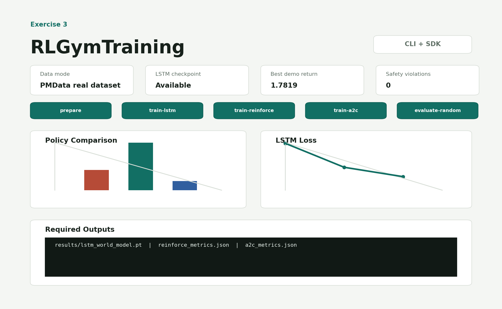

# RLGymTraining - Exercise 3

Educational project for personalized workout recommendation with an LSTM world model, REINFORCE, and Advantage Actor-Critic. This is not medical advice and not a production recommendation system.

## Why This Is RL
Prediction answers: "what happens next?" A policy answers: "what should the agent do next?" This project uses prediction only as a world model: an LSTM learns trainee dynamics so RL agents can practice sequential decisions. The objective is cumulative return over a full training episode, not local next-state accuracy alone.

RL mapping:

| Term | Implementation |
|---|---|
| Agent | REINFORCE or A2C trainer choosing workout actions |
| Environment / World Model | LSTM dynamics model plus reward and safety mask |
| State | Numeric trainee vector: readiness, fatigue, strength, endurance, soreness |
| Action | `rest`, `cardio`, `strength`, or `mixed` |
| Reward | Progress and readiness reward minus fatigue, soreness, overload, invalid-action penalties |
| Episode | Configurable sequence of training days, default 28 |
| Policy | Stochastic policy `pi_theta(a\|s)`, a probability distribution over workout actions |
| Return | Discounted cumulative reward |
| Critic | A2C value estimator `V(s)` |

## Installation

```powershell
uv sync --extra dev
```

## Commands

```powershell
uv run python scripts/download_pmdata.py
uv run rl-gym-training prepare
uv run rl-gym-training train-lstm
uv run rl-gym-training train-reinforce
uv run rl-gym-training train-a2c
uv run rl-gym-training evaluate-random
```

Quality checks:

```powershell
uv run pytest
uv run ruff check .
uv run ruff format --check .
```

Current local validation:

- `uv sync --extra dev`: failed before dependency sync because the user-level uv cache path already existed as a file
- `UV_CACHE_DIR=.uv-cache uv sync --extra dev --system-certs`: passed
- `uv run pytest`: 20 passed
- `uv run ruff check .`: passed
- `uv run ruff format --check .`: passed

## Data

The preferred workflow uses PMData, a real Kaggle-listed sports logging dataset. The helper script does not use the Kaggle API. It downloads the needed PMData wellness/sRPE CSV files from the public OSF mirror when network access is available, or transforms matching local files already placed under `data/raw/pmdata/pXX/`:

```powershell
uv run python scripts/download_pmdata.py
```

This creates `data/raw/workout_sequences.csv` from the discovered PMData participants. The committed local run used 16 participants. If the OSF mirror is unavailable, manually download PMData from Kaggle or OSF, place files like `data/raw/pmdata/p01/wellness.csv` and optional `data/raw/pmdata/p01/srpe.csv`, then rerun the command above and `uv run rl-gym-training prepare`. Required columns are documented in [docs/PRD_data_pipeline.md](docs/PRD_data_pipeline.md). Synthetic fallback exists only for tests and explicit demo use; it is disabled in the default config.

Processed chronological splits are saved under `data/processed/`. Scaling is fitted only on training rows and then applied to validation/test rows.

## Algorithms

REINFORCE optimizes `J(theta) = E[R(tau)]`. It samples actions from `pi_theta(a|s)`, stores log probabilities and rewards, computes discounted returns, and increases the probability of actions that appeared in high-return trajectories. It is on-policy: no replay buffer and no Q-table are used.

Basic REINFORCE has high variance because one sampled trajectory can be noisy. Reward-to-go and return normalization improve credit assignment by making each action depend more on future rewards after that action.

A2C separates Actor and Critic. The Actor outputs `pi_theta(a|s)`. The Critic estimates `V(s)` and acts as a learned baseline. Training uses:

```text
target = r + gamma * V(s_next) * (1 - done)
advantage = target - V(s)
actor_loss = -log_prob(action) * detached_advantage
critic_loss = MSE(V(s), target)
```

A2C is often more stable and sample-efficient than vanilla REINFORCE because the Critic supplies lower-variance feedback at each step.

## LSTM World Model

The LSTM predicts the next trainee state from a sequence of past states and actions. It is useful because fatigue, soreness, and progress are partially observable: one daily snapshot may not capture trend, recovery, or hidden load. The hidden state summarizes recent history, which connects the design to POMDP and learned-world-model ideas.

## Configuration And Security

All important hyperparameters live in `config/setup.yaml`: data path, split ratios, sequence length, seed, gamma, episode length, learning rates, entropy coefficient, and reward weights. No personal absolute paths or secrets are required. `.env-example` documents that no API key is needed for the demo/test path.

## Outputs

- `data/processed/train.csv`, `validation.csv`, `test.csv`
- `results/lstm_world_model.pt`
- `results/reinforce_policy.pt`
- `results/a2c_actor.pt`
- `results/a2c_critic.pt`
- `results/reinforce_metrics.json`
- `results/a2c_metrics.json`
- `results/random_policy_metrics.json`

## Visual Demonstration

Project workflow overview:



Demo LSTM world-model training curve:


PMData policy comparison:


PMData labels vs A2C evaluation action distribution:


These images are generated from the current demo metrics and project workflow. To regenerate them after a new run:

```powershell
uv run python scripts/generate_readme_assets.py
```

The first and tuned PMData runs are compared in [docs/EXPERIMENTS.md](docs/EXPERIMENTS.md), including the original A2C `rest`/`mixed` behavior and the later tuned action distribution.

## Documentation

- [docs/PRD.md](docs/PRD.md)
- [docs/PLAN.md](docs/PLAN.md)
- [docs/TODO.md](docs/TODO.md)
- [docs/PRD_problem_formulation.md](docs/PRD_problem_formulation.md)
- [docs/PRD_data_pipeline.md](docs/PRD_data_pipeline.md)
- [docs/PRD_lstm_world_model.md](docs/PRD_lstm_world_model.md)
- [docs/PRD_reward_function.md](docs/PRD_reward_function.md)
- [docs/PRD_reinforce.md](docs/PRD_reinforce.md)
- [docs/PRD_a2c.md](docs/PRD_a2c.md)
- [docs/EXPERIMENTS.md](docs/EXPERIMENTS.md)
- [docs/ASSESSMENT_COVERAGE.md](docs/ASSESSMENT_COVERAGE.md)
- [docs/PMDATA_DATASET.md](docs/PMDATA_DATASET.md)
- [docs/AI_WORKFLOW.md](docs/AI_WORKFLOW.md)
- [docs/COST_ANALYSIS.md](docs/COST_ANALYSIS.md)
- [docs/VERSION_HISTORY.md](docs/VERSION_HISTORY.md)

## Extension Points

Add a new dataset by changing `data.raw_path` and column names in config. Add a new action by updating `ACTION_NAMES`, the one-hot encoding, reward rules, and action mask. Replace the LSTM with a Transformer/RNN behind the same world-model interface. Add PPO later by creating a new `rl/ppo.py` and service wrapper. Safety constraints can be changed in `rl/action_masking.py`. A future dashboard can call the SDK without changing algorithm code.

## Known Limitations

The project now uses PMData for the local experiment evidence, but raw PMData files are not committed because dataset files belong under ignored `data/raw/`. The LSTM world model is compact for coursework and CPU feasibility. Safety constraints are illustrative and not clinically validated. On the local PMData run, REINFORCE achieved `2.4954` average evaluation return, A2C achieved `1.6647`, and the random masked baseline achieved `-0.8265`; all reported policies had zero safety violations. This does not show that REINFORCE is generally better than A2C. The run is small, noisy, lightly tuned, and reward/action-mask design may favor simpler policy updates while the A2C critic may need more tuning. These are educational pipeline checks, not medical or production claims.

## References

- Course Exercise 3 PDFs in the repository.
- REINFORCE / policy gradient lecture material.
- Sutton and Barto, Reinforcement Learning: An Introduction.
- PyTorch documentation for LSTM, categorical distributions, and autograd.
